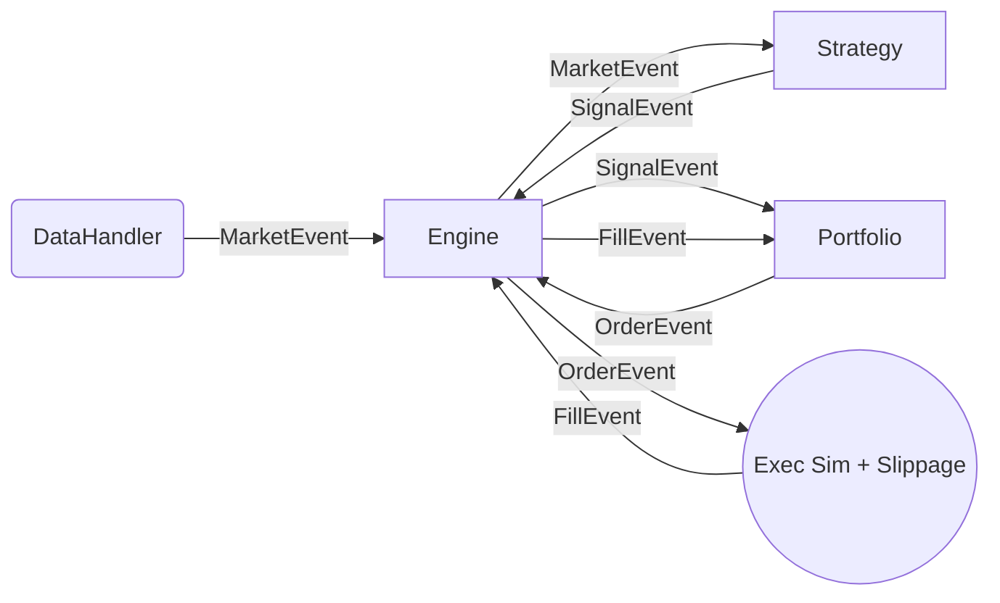

# Quantitative Backtesting Engine

An event-driven backtesting engine designed for incremental development and clear separation of concerns.
Built as a demonstration of Professional Quantitative Developer skills (Python).

## 🏗 Architecture

The system follows a strict **Event-Driven Architecture**, preferred in institutional trading systems for its realism (handling latencies, complex order types, and avoiding look-ahead bias).

### Core Components
1.  **Event Loop (`BacktestEngine`)**: The central nervous system. A FIFO queue consuming events sequentially.
2.  **Data Fetcher (`DataFetcher`)**: Connects to Yahoo Finance to download real-world data with local CSV caching.
3.  **Execution Simulator**: Now includes a realistic **Slippage Model** and **Commission logic** to simulate market impact.
4.  **Strategy**: Supports stateful strategies (e.g., **MA Crossover**). Logic produces `SignalEvent` objects.
5.  **Portfolio**: Manages Cash & Holdings. Features **Risk-Based Position Sizing** (quantity based on % equity risk).
6.  **Walk-Forward Analyzer**: Implements rolling in-sample optimization and out-of-sample validation to prevent overfitting.

### Event Flow


## 🚀 Getting Started

### Prerequisites
- Python 3.9+
- `pip`

### Installation
Clone the repository and install in editable mode:
```bash
pip install -e .
```

### Running the Professional Workflow
The project includes a comprehensive demo of a professional quant workflow:
1.  Open `notebooks/real_data_research.ipynb`.
2.  Observe the full lifecycle: **Data Fetching** → **Walk-Forward Validation** → **Final Backtest with Slippage** → **Performance Analysis**.

### Running Tests
Extensive test suite covering core engine, performance metrics, and validation logic:
```bash
pytest tests/
```

## 📊 Project Status

**Phase 1 (Python Core)**: ✅ Completed
- [x] Event Loop Skeleton & FIFO Queue
- [x] Data Ingestion (CSV)
- [x] Portfolio Management & Performance Metrics

**Phase 2 (Research & Visualization)**: ✅ Completed
- [x] Stateful Strategy Support (MA Crossover)
- [x] Parameter Sweep Runner & Heatmaps
- [x] Integration Testing for Research Workflow

**Phase 3 (Professional Enhancements)**: ✅ Completed
- [x] Real-world Data Integration (Yahoo Finance)
- [x] Local Data Caching Mechanism
- [x] Realistic Execution Model (Slippage & Commissions)
- [x] Risk-Based Position Sizing
- [x] **Walk-Forward Validation Module**

**Phase 4 (Performance Optimization)**: ✅ Completed
- [x] Migrate heavy strategy calculations to C++
- [x] Bind using `pybind11` for high-performance execution.

## ⚡️ C++ Optimization

To demonstrate the ability to identify bottlenecks and optimize performance, the core logic of the `MovingAverageCrossStrategy` has been implemented in C++.

### Performance Benchmark (100,000 events)
Using the **Fast Path** implementation (direct price feeding into C++), we achieve a significant performance boost:

| Implementation | Time (100k events) | Speedup vs Python |
| :--- | :--- | :--- |
| Python Core | ~0.28s | 1.00x |
| **C++ Fast Path** | **~0.08s** | **3.24x** |

### How to Build
A C++ compiler is required. The build is managed via `setuptools` and `pybind11`.
```bash
# Build the C++ extension locally
pip install setuptools pybind11
python setup.py build_ext --inplace
```

### Running the Benchmark
```bash
python benchmark_strategy.py
```

## 🤝 Contribution
Designed for clean code readability and extensibility. 
Strict typing and `pytest` coverage required for new modules.
