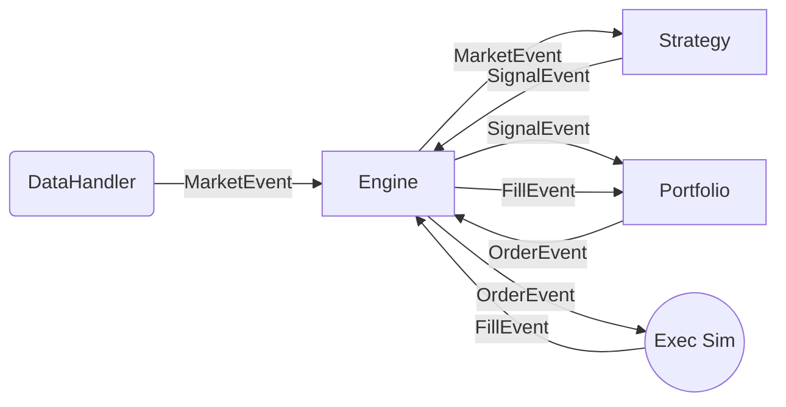

# Quantitative Backtesting Engine

An event-driven backtesting engine designed for incremental development and clear separation of concerns.
Built as a demonstration of Quantitative Developer skills (Python).

## 🏗 Architecture

The system follows a strict **Event-Driven Architecture**, preferred in institutional trading systems for its realism (handling latencies, complex order types, and avoiding look-ahead bias).

### Core Components
1.  **Event Loop (`BacktestEngine`)**: The central nervous system. A FIFO queue consuming events sequentially.
2.  **Data Feed (`DataHandler`)**: Drip-feeds historical data (`MarketEvent`) to simulate a live market.
3.  **Strategy**: Receives `MarketEvent` and decides whether to generate a `SignalEvent`. Now supports stateful strategies like **Moving Average Crossover**.
4.  **Portfolio**: Manages Cash & Holdings. Receives `SignalEvent` -> Generates `OrderEvent`. Updates state on `FillEvent`.
5.  **Research (`StrategyResearchRunner`)**: Orchestrates multiple backtests for parameter optimization and strategy sensitivity analysis.
6.  **Visualization**: Integrated plotting utilities for Equity Curves, Drawdown profiles, and Optimization Heatmaps.

### Event Flow


## 🚀 Getting Started

### Prerequisites
- Python 3.9+
- `pip`

### Installation
Clone the repository and install in editable mode:
```bash
pip install -e .
```

### Running Strategy Research
We've added a robust research layer to test strategy parameters at scale.
1.  Activate your environment.
2.  Open `notebooks/research_ma_crossover.ipynb` in VS Code or Jupyter Lab.
3.  Run the cells to see a **Moving Average Crossover** parameter sweep with interactive heatmaps.

### Running Tests
Unit and integration tests use `pytest`:
```bash
pytest tests/
```

## 📊 Project Status
**Phase 1 (Python Core)**: ✅ Completed
- [x] Event Loop Skeleton
- [x] Data Ingestion (CSV)
- [x] Portfolio Management (Cash/Holdings)
- [x] Performance Metrics (Sharpe, Drawdown)

**Phase 2 (Research & Visualization)**: ✅ Completed
- [x] Stateful Strategy Support (MA Crossover)
- [x] Parameter Sweep Runner
- [x] Visualization Layer (Matplotlib/Seaborn)
- [x] Integration Testing for Research Workflow

**Phase 3 (Optimization/C++)**: 🚧 Planned
- [ ] Migrate `Strategy` calculation to C++
- [ ] Bind using `pybind11` for high-performance backtesting.

## 🤝 Contribution
Designed for clean code readability and extensibility. 
Strict typing and `pytest` coverage required for new modules.
