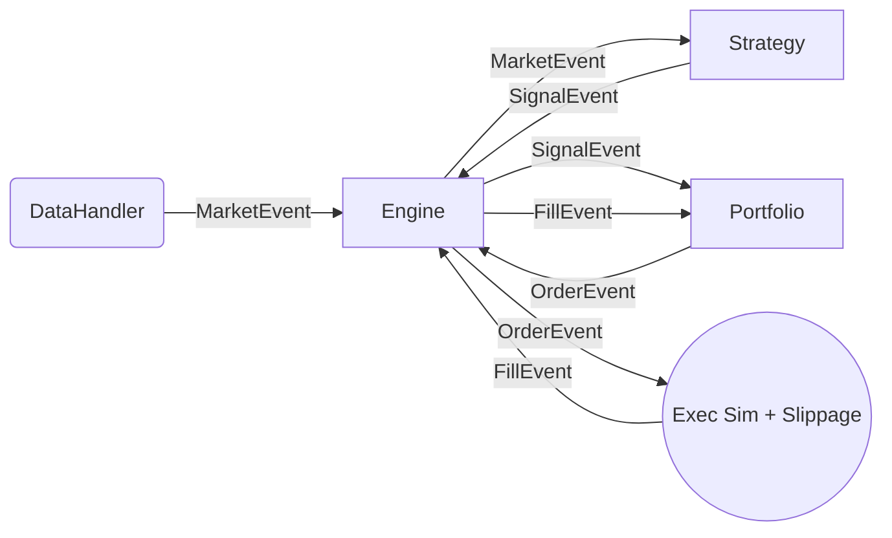

# Event-Driven Quantitative Backtesting Framework

A high-performance algorithmic trading simulation engine built with Python and C++. This framework demonstrates institutional-grade architectures for backtesting, featuring realistic execution modeling, walk-forward validation, and a scalable REST API.

---

## 🏗 Architecture

The system follows a strict **Event-Driven Architecture**, ensuring high fidelity by simulating market latencies, handling complex order flows, and eliminating look-ahead bias.



### Core Components
- **`BacktestEngine`**: Central event loop managing a FIFO queue of market, signal, order, and fill events.
- **`Strategy` Layer**: Support for stateful Python strategies and high-performance C++ extensions.
- **`Portfolio`**: Real-time position tracking with risk-based sizing and equity delta management.
- **`Execution`**: Simulated exchange with configurable slippage and commission models.
- **`DataHandler`**: Yahoo Finance integration with local CSV caching for rapid iteration.

---

## 📈 Project Evolution

This project was built incrementally, evolving from a simple event loop into a production-ready system.

*   **Phase 1: Foundation**: Core event loop, FIFO queue, and basic market data ingestion.
*   **Phase 2: Strategy & Portfolio**: Stateful strategy support and equity curve tracking.
*   **Phase 3: Realism**: Implementation of slippage, commissions, and risk-adjusted position sizing.
*   **Phase 4: Optimization**: Migration of compute-intensive strategy logic (MA Crossover) to C++ using `pybind11`.
*   **Phase 5: Research Engine**: Multi-threaded parameter sweeps, heatmaps, and Walk-Forward Validation.
*   **Phase 6: Professional API**: FastAPI service with async job management and status tracking.
*   **Phase 7: Persistence**: PostgreSQL integration with SQLAlchemy and Alembic for historical storage.

---

## 🚀 Getting Started

### Prerequisites
- Docker & Docker Compose
- Python 3.12+ (if running locally)
- C++ Compiler (for C++ extensions)

### Execution Mode: Docker (Recommended)
The easiest way to run the full stack (API + Database + Monitoring) is using the containerized environment:

1.  **Start the Stack**:
    ```bash
    docker-compose up -d --build
    ```
2.  **Verify Deployment**:
    - **Health Check**: [http://localhost:8000/health](http://localhost:8000/health)
    - **Interactive API Docs**: [http://localhost:8000/docs](http://localhost:8000/docs)
    - **Database Admin (Adminer)**: [http://localhost:8080](http://localhost:8080)

### Development Mode: Local Setup
To run the framework outside of Docker for development:

1.  **Initialize Environment**:
    ```bash
    python -m venv .venv
    .venv\Scripts\activate  # Windows
    # source .venv/bin/activate  # Unix
    ```
2.  **Install Framework & C++ Extension**:
    ```bash
    pip install -e .
    python setup.py build_ext --inplace
    ```

---

## 🔍 What to Check

### 1. Research Notebooks
Explore the framework's capabilities through the interactive notebooks in `/notebooks`:
- **`real_data_research.ipynb`**: Demonstrates the full quant workflow: Data Fetching → Walk-Forward Validation → Performance Analysis.
- **`benchmark_cpp.ipynb`**: Compares the Python vs. C++ implementation, showcasing a ~3.2x speedup in signal calculation.

### 2. REST API & Job Management
The system supports asynchronous backtest execution. You can submit jobs via the API and track their progress through the database-backed manager.
- Submit a backtest: `POST /backtest/run`
- Check results: `GET /results/{job_id}`

### 3. Verification & Tests
Ensure the integrity of the framework by running the comprehensive test suite:

- **Unit & Integration Tests**:
  ```bash
  pytest tests/
  ```
- **End-to-End System Test** (Requires Docker/API running):
  ```bash
  python tests/test_end_to_end.py
  ```

---

## 🗄️ Technical Details
- **Backend**: FastAPI
- **Database**: PostgreSQL with SQLAlchemy & Alembic
- **Optimization**: C++11 with `pybind11`
- **Data**: Yahoo Finance API integration
- **Containerization**: Docker Multi-stage builds
